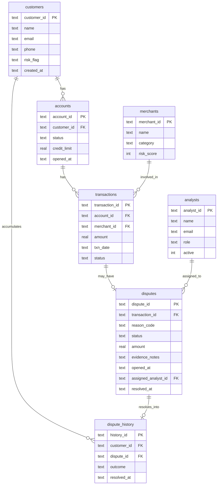

# Entity-Relationship Diagram — Dispute & Chargeback Database

## Relationship notes
- A **customer** has many **accounts**, and separately accumulates many **dispute_history** rows over time.
- An **account** has many **transactions**.
- A **merchant** is involved in many **transactions**.
- A **transaction** may have **zero or one dispute** (not every charge is disputed).
- An **analyst** is assigned to many **disputes**.
- A resolved **dispute** produces one **dispute_history** row for that customer.